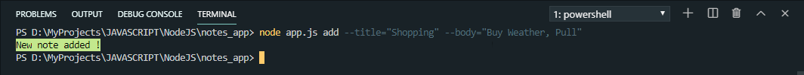
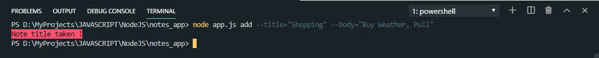
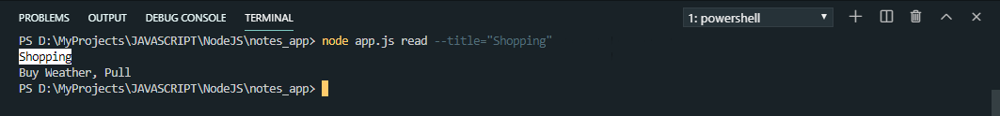
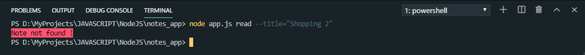
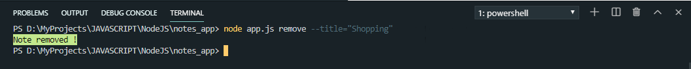
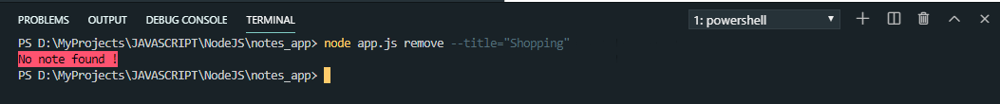
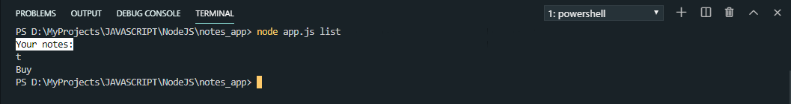
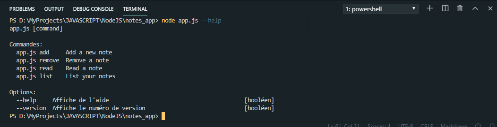
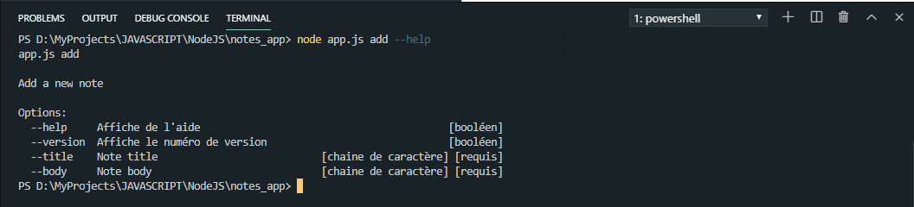

# notes_app

A simple console application to record your notes quickly

# Installation

First we will clone the github repository in the wish folder

`git clone https://github.com/StephaneKuma/notes_app.git`

`cd notes_app`

Secondly we will install the npm dependencies

`npm install`

**You are ready to rock**

# Features

1. Add a new note
2. Read a note
3. Remove a note
4. List all notes

## Add a new note

> Add a new note by running this command

`node app.js add --title="Note title" --body="Note body"`

> Adding a new note with an existing title makes this error

## Read a note

> To read a note execute this command

`node app.js read --title="Shopping"`

> Read a note with a non-existent title makes this error

## Remove a note

> To remove a note, execute this command

`node app.js remove --title="Shopping"`

> Trying to remove a note which not exist output this error

## List all notes

> See all notes by running this command

`node app.js list`

# Help

> To see available command execute this

`node app.js --help`

> Want to see help concerning specific command, execute *node app.js command --help*.
For exemple, we will see add command help

`node app.js add --help`

